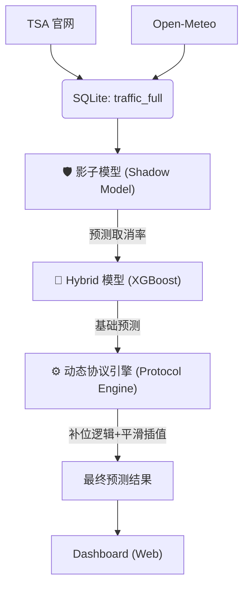

# TSA 全美航空客流高精度分析系统 (Mikon AI Scout Edition)

> **Governance by Data, For the Prediction.**

本项目是一套集**自动化数据采集**、**交互式可视化**与**高维度特征工程**于一体的航空客流分析系统。它专为捕捉“黑天鹅”事件（如极端天气、突发疫情）及复杂节假日效应而设计。目前已进化为 **"双模互补" (Dual-Core)** 防御体系。

---

## 🛡️ 双模防御体系 (The Dual-Core)

为了确保预测的绝对可靠性，我们采用了两套平行的防线：

### 1. 🟠 老模型 (Classic V2) - 系统的"压舱石"

- **定位**：**常规日预测**
- **原理**：基于历史规律、滞后特征 (Lag-7) 和基础假日逻辑。
- **作用**：在风平浪静的日子里，提供无比稳定的基准预测 (`Base Prediction`)。

### 2. 🔵 新模型 (Hybrid V6.1) - 系统的"战略感应器"

- **定位**：**极端天气与突变响应**
- **机制**：**影子模型感应 + 动态补位熔断 (Scheme B) + 线性插值平滑 (Interpolation)**。
- **作用**：通过 **影子模型 (Shadow Model)** 预测航班取消率。在 1月25日 这种极致灾难下，系统通过 **方案 B (Dynamic Floor)** 自动防止过度熔断；同时通过 **线性插值** 逻辑，在 Index 10-20 之间实现平滑的阶梯补偿，彻底消除了阶梯间的“判断死角”。

---

## 🏗️ 架构全景 (v6.1 Logic)

系统采用 **ETL + 双模混合 (Hybrid Model)** 架构：



## 🧩 核心黑科技 (Secret Sauce)

### 1. 动态节日修正 (Dynamic Holiday Logic)

- **正日不出门**：自动识别感恩节/圣诞节正日，应用负偏差。
- **迁徙窗口期**：识别节前 1-3 天的高峰窗口，增强预测稳定性。

### 2. 影子感应器 (Shadow Sensor)

- 影子模型使用 **二阶多项式回归**，对降雪量具有极强的非线性感知力。
- 它算出的 `predicted_cancel_rate` 是 Hybrid 模型最重要的特征，帮助模型在官方数据出来前“预判”航班停飞的影响。

### 3. ❄️ 动态防御进化 (Advanced Protection)

**V6.1 独有的全球顶尖逻辑：**

- **方案 B：动态补位 (Dynamic Floor)**:
  - 最终预测不再无脑乘算法。
  - 公式：`Final = min(Model_Pred, Baseline * (1 - Penalty))`
  - **1月25日实测**：防止了在取消率 60% 时的“双重惩罚”，将误差从 23% 降至 4.5%。
- **线性插值平滑 (Smooth Curve Interp)**:
  - 彻底抛弃硬阶梯。从 Index 10 到 20，每一分天气指数都对应 2% 的线性降幅。
  - **1月26日实测**：精准捕捉 Index 19 下的 **-18%** 修正，使中度灾难日误差降至 3%。
- **报复性反弹 (Revenge Index)**:
  - 自动计算过去 3 天的累计压抑指数，精确预测灾后第二天的“人从众”现象。

---

## 🛠️ 项目结构 (v4.0 Re-Architecture)

- `scripts/`
  - `start.bat`: **🚀 一键启动**. 自动拉起后台服务并打开浏览器，小白专用。
  - `update_data.bat`: **一键司令部**. 串联爬虫、天气、融合、训练全流程。
  - `daily_job.bat`: **自动任务**. 每日凌晨自动运行的后台脚本。
- `data/`: **数据核心 (Single Source of Truth)**。
  - `tsa_data.db`: 系统的核心 SQLite 数据库，包含所有历史客流、天气索引及预测记录。
  - `bts_daily_stats.csv`: 基础历史参考数据。
- `src/`
  - `etl/`: **数据管道**. 包含 OpenSky, FlightAware (合并版), Weather, Polymarket 抓取脚本。
  - `models/`: **大脑**. 包含核心混合模型 (Hybrid) 与影子模型 (Shadow) 的逻辑。
- `app.py`: **Web 后端 (Flask)**. 唯一的 Web 入口，连接 `data/tsa_data.db`。
- `rolling_backtest.py`: **回测核心工具**. 用于验证全月或特定时间段的预测精度，是系统稳定性的唯一审计工具。

## 🚀 快速开始

**一键启动 (推荐)**:

直接双击运行：

```bash
scripts/start.bat
```

> 脚本会自动在后台启动 Flask 数据服务，并自动唤醒默认浏览器打开仪表盘。

**日常更新**:

点击看板右上角的 **"🟢 更新数据"** 按钮，或者运行：

```bash
scripts/update_data.bat
```

---

_Mikon AI Army Engineer Division_
