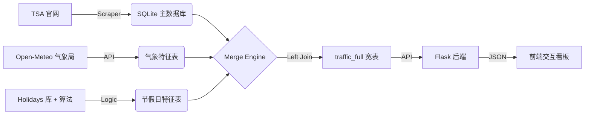

# TSA 全美航空客流高精度分析系统 (Mikon AI Scout Edition)

> **Governance by Data, For the Prediction.**

本项目是一套集**自动化数据采集**、**交互式可视化**与**高维度特征工程**于一体的航空客流分析系统。它专为捕捉“黑天鹅”事件（如极端天气、突发疫情）及复杂节假日效应而设计，为 Prophet/XGBoost 等预测模型提供高质量的“燃料”。

---

## 🏗️ 架构全景

系统采用 **ETL (Extract, Transform, Load)** 架构，数据流向清晰：



## 🧩 核心算法详解 (The Secret Sauce)

这是本系统的核心竞争力所在。我们不只是简单的罗列数据，而是注入了深度业务逻辑。

### 1. 多枢纽熔断气象模型 (Hub Meltdown Model)

传统模型只看单一机场，无法理解全美航空网的**连锁反应**。我们设计了由 5 大枢纽（ATL, ORD, DFW, DEN, JFK）组成的熔断机制。

- **监测指标**: 积雪 (`Snowfall > 1.0cm`), 强风 (`Windspeed > 29.0km/h`), 暴雨 (`Rain > 20mm`).
- **坏点判定 (Bad Hub)**: 单个机场若触发上述任一阈值，得 **3-5 分**，标记为坏点。
- **系统熔断公式**:
  $$ Final Score = \sum (Hub Scores) + Penalty $$
  - **Penalty 规则**:
    - 若 **2 个** 枢纽同时沦陷: **+10 分** (严重拥堵)
    - 若 **3 个及以上** 枢纽沦陷: **+20 分** (系统熔断/Meltdown)

> **实战案例**: 2022 年 12 月 22 日“炸弹气旋”期间，系统检测到 5 大枢纽全军覆没，基础分 16 分 + 熔断分 20 分 = **36 分**。模型准确识别出这是灾难级的一天。

### 2. 复活节优先策略 (Easter Priority Patch)

`holidays.US` 库天然缺失非联邦假日的复活节，但它是航空出行的绝对高峰。我们实施了**强注入逻辑**：

- **计算**: 使用 `dateutil.easter` 动态计算每年复活节日期。
- **窗口**:
  - **Good Friday** (-2 天)
  - **Holy Saturday** (-1 天) [新增]
  - **Easter Sunday** (0 天)
  - **Easter Monday** (+1 天)
- **优先级**: 权重设为 Tier 2，直接写入 `is_holiday`，强制覆盖。

### 3. 春假启发式算法 (Spring Break Heuristics)

春假没有固定日期，但有规律可循。我们采用**排除法**定义春假，避免与确定的节日冲突：

```python
if (Month in [3, 4]) AND (Is_Weekend) AND (Not Holiday):
    is_spring_break = 1
else:
    0
```

> **效果**: 既捕捉到了大学生春假带来的周末客流高峰，又不会干扰复活节等正日子的权重。

### 4. 超级碗效应 (Super Bowl Algorithm)

每年 2 月的重磅体育赛事，引发巨大的非典型迁徙。

- **定位**: 每年 2 月的第 2 个星期日。
- **窗口**: Super Bowl Sunday + Post-SB Monday (回流日)。
- **动作**: 强制设为 Tier 2 节日，覆盖其他特征。

---

## 🛠️ 项目结构

- `build_tsa_db.py`: **爬虫**. 智能识别 TSA 页面结构，增量更新数据。
- `get_weather_features.py`: **气象站**. 抓取历史存档及未来 15 天预报，计算熔断指数。
- `add_features.py`: **日历**. 生成 Tier 1/2/3 分级联邦假日特征。
- `merge_db.py`: **总装**. 基于全量时间轴 (Timeline Strategy) 生成 `traffic_full` 表。
- `app.py` & `static/`: **看板**. 基于 Flask + Chart.js 的高性能交互式图表。

## 🚀 快速开始

1. **环境安装**:

   ```bash
   pip install flask pandas requests lxml holidays openmeteo-requests requests-cache retry-requests python-dateutil
   ```

2. **数据管线跑通**:

   ```bash
   python build_tsa_db.py        # 1. 抓客流
   python add_features.py        # 2. 算假日
   python get_weather_features.py # 3. 算天气
   python merge_db.py            # 4. 合并宽表
   ```

3. **启动看板**:
   ```bash
   python app.py
   # 访问 http://127.0.0.1:5000
   ```

## 🔮 未来路线图 (Roadmap)

为了进一步逼近 99.9% 的预测精度，我们在下一阶段将关注以下“隐形大 BOSS”：

- [ ] **超级碗 (Super Bowl)**: 2 月最强单向客流事件。
- [ ] **母亲节 (Mother's Day)**: 5 月全家出行高峰。
- [ ] **开学季 (Back to School)**: 8 月持续性客流爬坡。
- [ ] **模型接入**: 正式引入 Prophet 或 XGBoost 消耗 `traffic_full` 数据。

---

_Mikon AI Army Engineer Division_
