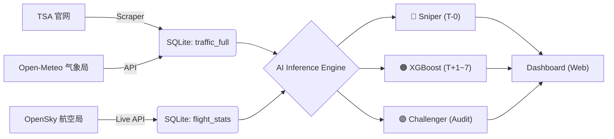

# TSA 全美航空客流高精度分析系统 (Mikon AI Scout Edition)

> **Governance by Data, For the Prediction.**

本项目是一套集**自动化数据采集**、**交互式可视化**与**高维度特征工程**于一体的航空客流分析系统。它专为捕捉“黑天鹅”事件（如极端天气、突发疫情）及复杂节假日效应而设计。目前已进化为 **"三位一体" (Trinity)** 防御体系。

---

## 🛡️ 三位一体防御体系 (The Trinity)

为了确保预测的绝对可靠性，我们设计了三道防线：

### 1. 🔴 狙击模型 (The Sniper)

- **定位**：**当下盲区补全 (T-0 Nowcasting)**
- **痛点**：TSA 官方数据滞后 24 小时发布。
- **原理**：利用 OpenSky 实时的“航班起降数据” + 昨日客流，推算**此时此刻**的客流量。
- **触发**：红色按钮 `🎯 狙击模型`。

### 2. 🟠 主力模型 (The Main Core)

- **定位**：**未来趋势预测 (T+1~7 Forecasting)**
- **核心**：**XGBoost Regressor**。
- **原理**：基于历史规律、季节性、天气预报、节假日逻辑，生成稳健的未来 7 天预测。
- **触发**：绿色按钮 `更新数据` 自动运行，或蓝色按钮 `🚀 立即预测`。

### 3. 🟣 挑战者模型 (The Challenger)

- **定位**：**独立审计员 (Independent Auditor)**
- **核心**：**LightGBM** (与主力模型不同构)。
- **原理**：**不信任缓存**。每次点击时，直接从数据库读取最新鲜的数据，现场重新训练。用作“二审”来验证主力模型的准确性。
- **触发**：紫色按钮 `🟣 深度对决`。

---

## 🏗️ 架构全景 (v3.0 Logic)

系统采用 **ETL + 混合模型 (Hybrid Model)** 架构：



## 🧩 核心黑科技 (Secret Sauce)

### 1. 动态节日修正 (Dynamic Holiday Logic)

- **Is_Holiday_Exact_Day (正日)**: 标记感恩节、圣诞节当天，模型学会了**"正日不出门"**（负系数）。
- **Is_Holiday_Travel_Window (窗口期)**: 标记节日前后 7 天，模型学会了**"节前大迁徙"**（正系数）。
- **动态计算**: 抛弃静态 CSV，使用 Python `holidays` 库动态生成未来节日特征，确保永远不会“漏过”任何一个假期。

### 2. 航班流关联 (Flight Volume Correlation)

- 引入 **OpenSky Network** 实时数据。发现“航班量”与“客流量”存在 0.85+ 的强相关性，并将其作为强特征引入 Sniper 和 Challenger 模型。

---

## 🛠️ 项目结构

- `start.bat`: **🚀 一键启动**. 自动拉起后台服务并打开浏览器，小白专用。
- `update_data.bat`: **一键司令部**. 串联爬虫、天气、融合、训练全流程。
- `fetch_opensky.py`: **空中雷达**. 抓取全球 Top 10 机场实时航班数据。
- `predict_sniper.py`: **狙击手内核**. 负责 T-0 实时预测 (独立即时训练引擎)。
- `train_xgb.py`: **主力引擎**. 负责 T+1~7 预测 (生成 `xgb_forecast_v1.json`)。
- `train_challenger.py`: **挑战者引擎**. 负责实时审计预测。
- `merge_db.py`: **数据熔炉**. 将多源数据清洗并注入 `tsa_data.db`。
- `app.py`: **Web 后端 (Flask)**.

## 🚀 快速开始

**一键启动 (推荐)**:

直接双击运行根目录下的：

```bash
start.bat
```

> 脚本会自动在后台启动 Flask 数据服务，并自动唤醒默认浏览器打开仪表盘。

**日常更新**:

点击看板右上角的 **"🟢 更新数据"** 按钮，或者运行：

```bash
./update_data.bat
```

---

_Mikon AI Army Engineer Division_
